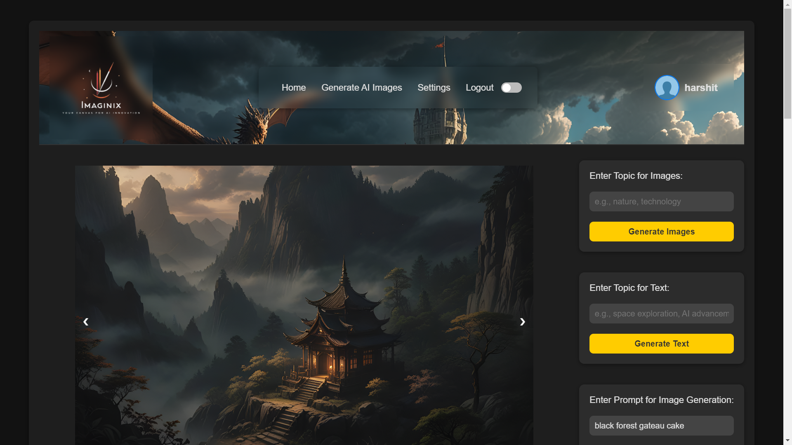

# Imaginx V1

Imaginx is a powerful web application that leverages AI to generate stunning images and engaging text content. Whether you're looking for unique visuals or creative writing, Imaginx provides an intuitive platform for all your content generation needs. This project was created with the help of ChatGPT prompting and my own efforts.



## Features

- **AI Image Generation**: Generate unique images using advanced AI models.
- **Stock Images Search**: Access and fetch high-quality stock images from Unsplash based on your chosen topics.
- **Text Generation**: Create detailed articles or creative text using Hugging Face's GPT-2 model.
- **Image Gallery**: View, download, and manage previously generated images in a convenient gallery format.

## Technologies Used

- **PHP**: Server-side scripting language for backend logic.
- **MySQL**: Relational database for storing user data and generated content.
- **HTML/CSS/JavaScript**: Frontend technologies for building the user interface.
- **Unsplash API**: For fetching stock images.
- **Hugging Face API**: For generating text using AI models.

## Installation

1. Clone the repository:
   ```bash
   git clone https://github.com/HarshitJain1924/Imaginx.git
   cd Imaginx
   ```

2. Set up your local environment:
   - Ensure you have XAMPP installed.
   - Move the project folder to the `htdocs` directory of XAMPP.

3. Create a MySQL database:
   - Open phpMyAdmin and create a new database named `content_generator`.
   - Import the SQL file provided in the project (if applicable) to set up the necessary tables.

4. Configure environment variables:
   - Create an `env.php` file in the project root and define your database credentials and API keys.
   ```php
   <?php
   putenv('DB_HOST=localhost');
   putenv('DB_USER=root');
   putenv('DB_PASS=');
   putenv('DB_NAME=content_generator');
   putenv('HUGGING_FACE_API_URL=https://api-inference.huggingface.co/models/gpt2');
   putenv('UNSPLASH_API_KEY=your_unsplash_api_key_here');
   ?>
   ```

5. Start the XAMPP server and navigate to `http://localhost/imaginx` in your browser to access the application.

## Usage

- Log in or register to access the platform.
- Generate images by entering your desired topic and exploring stock images.
- Create text content based on prompts related to your topic.
- View and manage generated images in the gallery section.

## Contributing

Contributions are welcome! If you have suggestions for improvements or new features, please open an issue or submit a pull request.

## License

This project is licensed under the MIT License.

## Acknowledgments

This project was made possible through the assistance of ChatGPT prompting and my own work. Thank you for exploring Imaginx!
